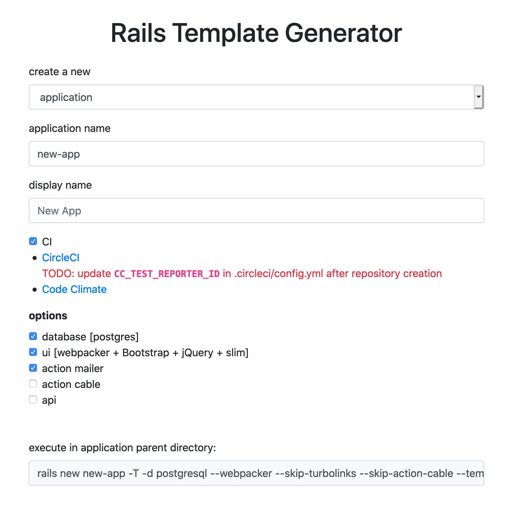
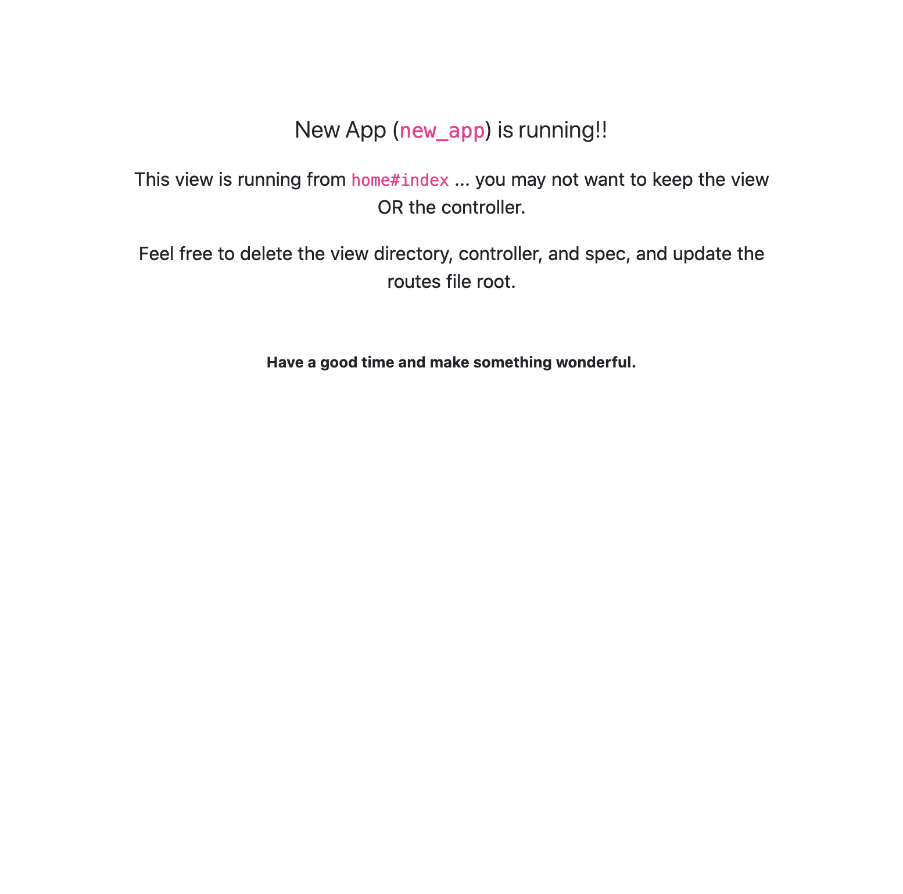

# Rails Template Generator

[github.com/Beyond-Finance/rails-template-generator](https://github.com/Beyond-Finance/rails-template-generator/)

Standing up a new Rails application or plugin is (relatively) simple and straightforward (and fun!).

Even so, given the flexibility of the Rails framework, there is a lot to do after issuing a `rails new` command to get everything just right before beginning to write feature code. _And_ getting the flags for that `rails new` command can take a little effort as well.

At Beyond, we manage a range of applications and gems, and when we need to create something new, we want the technologies and configurations we employ to start from a standard that will make moving between repositories an easy and familiar experience.

If we need a new application that behaves like another application we already know and understand, we'd like to start writing that code in 10 minutes instead of in three hours ... or three days.

Rails Template Generator is itself a Rails application which:
- Provides a simple form for selecting options and configuration for a new Rails application or plugin
- Outputs the `rails new` command for the selections, with a link to a template script supporting the selections
- Serves the linked, customized template script for installing and configuring the new application/plugin beyond what command line flags can achieve

## Template scripts

Template scripts are built into Rails for `new` commands by providing a link to the `--template` flag in the command.

The linked resource is loaded and executed as ruby, with access to the actions provided by [Thor](https://rubydoc.info/github/wycats/thor/master/Thor/Actions), just like an install generator from a gem.

As such, the linked script allows creation, execution, deletion, and manipulation of the new Rails assets. Which means, after the basic Rails instantiation, we are able to add gems, run installers, add configuration files, and do any of the things we may do manually while running through a formal checklist.

Both `rails new` and `rails plugin new` accept the flag, and execute the template scripts the same way. Of course, what the scripts _do_ varies according to what we're creating, but how the template scripts serve and run is the same.

For the Rails Template Generator, the selections made on the form may prompt specific flags for the `new` command (and even if that command is a `rails new` or `rails plugin new` command), but we also use these selections as parameters for dynamically building the appropriate template script for the command.

A headless service doesn't need a ui, and a ui-only client-facing application may not need a database; a template script for either should only try to set up what we need.

To get a closer look at how these scripts are structured, navigate to the link in a browser and observe the code. Feel free to append a `.txt` extension to make it a little more readable. The result will look like (and be) ruby script, with all of the file additions and substitutions inlined. The template script is a standalone resource without external dependencies, aside from what it tries to install when it runs. After the template source is captured, the Rails Template Generator application is no longer required for instantiation.

## Configuration

The Rails Template Generator produces a configurable output, but is opinionated according to the preferences here at Beyond.

- Unit tests are executed with [RSpec](https://github.com/rspec/rspec-rails).
- [RuboCop](https://github.com/rubocop-hq/rubocop) is used for linting ruby code.
- Basic code coverage is measured with [SimpleCov](https://github.com/simplecov-ruby/simplecov); coverage is omitted for some framework classes but is otherwise set to 100%, and everything the template script adds also gets test coverage. So don't lower it! Just unit test all your code!

Gems and configuration are set up to enable deployment via AWS for applications.

Applications and mountable engines offer opt-in configurations. A plain plugin skips the additional options.

The **CI** option is selected by default, and will produce configuration for:
- [CircleCI](https://circleci.com/) for build and test
- [Code Climate](https://codeclimate.com/) for static analysis

In order to use the configuration, a consumer will need to set up the appropriate accounts. The CircleCI config file `.circleci/config.yml` includes a `TODO` for inserting the appropriate. `CC_TEST_REPORTER_ID`.

The **db** option, selected by default, will configure the application database for `postgres`.

The **ui** option, selected by default:
- Sets up [Slim](http://slim-lang.com/) as the view template language, including converting the application layout file to slim and linking expected base front end asset files.
- Configures [JavaScript Bundler for Rails](https://github.com/rails/jsbundling-rails/) to use [Webpack](https://webpack.js.org/) as the front end asset manager.
- Adds [Jest](https://jestjs.io/) for script tests.

Additional options drive flags for the `new` command and drive minimal, if any, template script actions.

## Usage

Visit the [rails-template-generator]() _or_, to run the template generator locally:

### optional: Local usage

- Clone the repository
- Make sure you have the dependencies: ruby (we use [rbenv](https://formulae.brew.sh/formula/rbenv) to manage our ruby versions), [postgresql](https://wiki.postgresql.org/wiki/Homebrew), [yarn](https://classic.yarnpkg.com/en/), and make sure to `gem install bundler` and `gem install foreman`. We like [Homebrew](https://brew.sh/) for managing our installations.
- Install the gem and package dependencies by running `bundle install` and `yarn install`
- Set up your dbs via `bin/rails db:create db:migrate`
- Run the application via `foreman start`
- Visit your localhost on port `3000`, and continue along ...

### Configuring a new `rails new`

Open the root of the application, and complete the form according the the features you wish to include in the new application or plugin.



After all selections have been made, the "execute in ... parent directory:" field will be populated with the `rails new` command you've configured.

Click the field to select its contents, copy it, and paste it to a shell prompt in the desired location. The new application or plugin will be created in the appropriately named subfolder.

Assuming you keep your local applications in a `work` directory, that may look something like:

```
% cd ~/work
work % rails new new-app -T -d postgresql -j webpack --skip-turbolinks --skip-action-cable --template "http://localhost:3000/templates/eyJjaSI6dHJ1ZSwiZGIiOiJwb3N0Z3Jlc3FsIiwidWkiOnRydWUsIm1haWxlciI6dHJ1ZSwiYWN0aW9uX2NhYmxlIjpmYWxzZSwiYXBpIjpmYWxzZSwiZGlzcGxheU5hbWUiOiJOZXcgQXBwIiwidHlwZSI6ImFwcGxpY2F0aW9uIn0="

      create
      create  README.md
      create  Rakefile
      ...
```

Following completion of the `new` operation, if the new code represents an application with a ui, you will be given the option to run tests and stand up the application. Selecting `y` will run the boilerplate rspec and jest tests, and start the application on localhost at port 3000.

```
Test + start application? y
         run  bin/rspec from "."
         ...
         run  yarn test from "."
         ...
         run foreman start from "."
12:11:14 js.1  | started with pid 56140
12:11:14 web.1 | started with pid 56141
...
12:13:25 rails.1     |
```

Visit the root of the site in a browser (eg, [http://localhost:3000/](http://localhost:3000/)), and you'll see the new empty home page of your new application.



_NOTE_ that if you're running the generator locally, after the template script begins to execute, you may shut down the generator app. A newly generated application will experience port collisions with the generator when run, so shutting the generator down to prevent that is advisable.

Get in there and make your changes! Ever onward!
